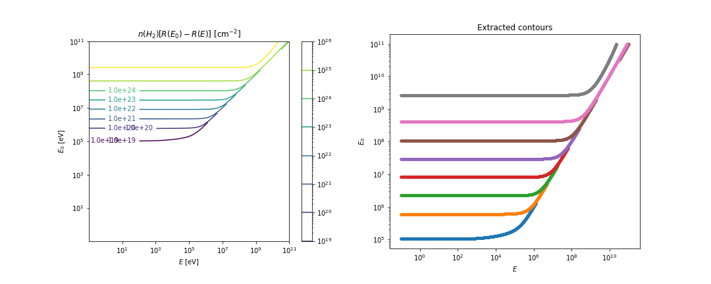

# reproduce_padovani
Reproducing the calculations in Padovani et al. A&amp;A 2009
Padovani et al, Cosmic-ray ionization of molecular clouds
https://doi.org/10.1051/0004-6361/200911794

In our manuscript, we need to "degrade" the cosmic ray spectrum as the CRs pass through a molecular cloud. Padovani provides a method for this (actually, the approach is taken from [Takayanagi, 1973](https://ui.adsabs.harvard.edu/abs/1973PASJ...25..327T/)). For simplicity, let’s assume that all CRs are protons, and that the cloud is made entirely of molecular hydrogen, $H_2$.

+ $j(E,N)$ 		Degraded CR spectrum after traversing column density $N(H_2)$
+ $j(E_0, 0)$		Starting spectrum incident on $H_2$ cloud (so $N(H_2)=0$)
+ $L(E)$		Energy loss function, related to stopping power by $L(E)= -\frac{1}{n(H_2)} \frac{dE}{dx}$
+ $R(E)$		Range of proton of energy $E = \frac{1}{n(H_2)} \int_0^E \frac{dE’}{L(E’)}$ (see Padovani Eqn. 22)

The key idea is that in the continuous slowing down approximation, and assuming conservation of CRs, we have $j(E,N) dE = j(E_0,0) dE_0$, and this gives: $j(E,N) = j(E_0,0)\frac{L(E_0)}{L(E)}$.
In other words, if we know (1) the loss function (2) the starting spectrum and (3) the mapping from $E_0$ to $E$, which depends on $N(H_2)$, then we can compute the degraded spectrum. The "hard" part is computing which energy $E_0$ will end up "degraded" to energy $E$. This mapping (which is 1-to-1) depends on $N(H_2)$, the column density of $H_2$. The sequence of calculation is then:

0. Get the raw spectra $j(E_0,0)$ as well as the energy loss function $L(E)$.   
    Here, we use two raw spectra `W98` and `M02`. Padovani provides $L(E)$ from 0.1 eV to 100 GeV (!).
1. Compute the range $R(E)$ for all proton energies (0.1 eV through 100 GeV).  
   This involves numerical integration of $1/L(E)$.
2. Compute the column density for each $E$, $E_0$ pair. Make a contour plot of $N(H_2)$ vs. $E$ and $E_0$.
3. Extract a single contour (corresponding to a single value of $N(H_2)$) and plot it. This gives a plot of $E_0$ vs. $E$.
4. Fit a function to $E_0$ vs. $E$ so that for any given value of $E$, we can determine what the starting energy $E_0$ would be (for that specific column density $N(H_2)$).  
Padovani recommends the following function:  $E_0(E,N) = (cE^b + \frac{N}{N_0})^{1/b}$.  (See Eqn. 26).  
**Q: $c$ and $b$ are fit parameters. What is $N_0$???**
5. Now that you know the $E_0 \leftrightarrow E$ mapping, you can compute $j(E,N)$.

I’ve started working through this process. See `cr_spectrum.ipynb`.

## Step 0: Get $j(E_0,0$ and $L(E)$
I used WebPlotDigitizer to pull data from Padovani Figures 5 (proton spectra) and 7 (energy loss functions $L(E)$):

## Step 1: Compute R(E)
### Step 1a: Validate against NIST PSTAR
I integrate $dE'/L(E')$ to find the particle range. I tested my approach using the NIST PSTAR data (which provides $dE/dx$ and range). I find good agreement between the PSTAR range and the range I calculate from $dE/dx$, except for a discrepancy at low proton energy (below 10 keV). The plots below show (left) the NIST PSTAR stopping ($dE/dx$ in units of MeV $cm^2$/g) as well as the Padovani energy loss function $L(E)$ scaled by an arbitrary amount (chosen by eye) to match the NIST curve. Note: $L(E)$ ("energy loss function") and $dE/dx$ ("stopping power") are related by factors of mass density and number density. See e.g. Eqn. 18 of Padovani: $L(E) = -\frac{1}{n(H_2)}\left(\frac{dE}{dx}\right)$.
I thought that the discrepancy between my calculated range and the NIST PSTAR range might be due to a resolution effect (numerical integration was too coarse), so I increased the number of data points in the integration (reduced the step size $dE$) from 1,000 to 100,000, but the range did not change. So something else is going on... Put that on the back-burner for now.

Also, notice that the NIST PSTAR stopping power differs in shape from Padovani's $L(E)$ at high proton energy (above 1 GeV). Up there, pion production matters. Padovani includes it in his $L(E)$, but presumably this energy loss pathway is not included in the PSTAR data... (though I don't know why it wouldn't be...)

### Step 1b: Compute range from Padovani's $L(E)$
Now that I (mostly) trust my numerical integration code that computes $R(E)$ from $L(E)$, I apply it to Padovani's $L(E)$. The plot below shows the result, along with the NIST PSTAR range (scaled arbitrarily for good by-eye-agreement). Remember that $L(E)$ from Padovani has units of $10^{-16} \mbox{eV cm}^2$, so the integral of $dE/L(E)$ has units of $10^{-16} cm^{-2}$. It's not a physical range, but rather the product of the $H_2$ cloud number density with the range: $n(H_2) R(E)$.

## Steps 2 and 3: Contour plot of $n(H_2) [R(E_0)-R(E)]$ and extract contour
We next make a contour plot of the range difference $n(H_2)\left[R(E_0)-R(E)\right]$. A single contour of that plot represents a fixed $N(H_2)$ column density, and that curve tells us the mapping between $E_0$ and $E$ (for a given column density $N(H_2)$. The plot at left is the contour plot. One contour line is shown in red. That specific contour is "extracted" as a single plot (at right).

## Step 4: Fit function $E_0(E)$ to the extracted contour
TBD

## Step 5: Compute $j(E,N)$ given $j(E_0,0)$ and $L(E)$
TBD

## To Do: 
There are several outstanding issues.
+ we lose low energy data during the analysis... need to update the WebPlotDigitize results to go all the way down to 0.1 eV (for both $j(E_0,0)$ and $L(E)$ ).
+ + how do we handle $n(H_2)$? It's not given. Do we even need to know it?
+ What is $N_0$ in the fitting function $E_0(E)$? Is it a fit parameter or some fundamental constant? Padovani does not explain.
+ Fitting of E_0(E) currently fails. If we don't care about the fit parameter values for a physical model, can't we just use some spline interpolation?

